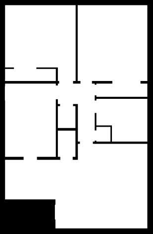
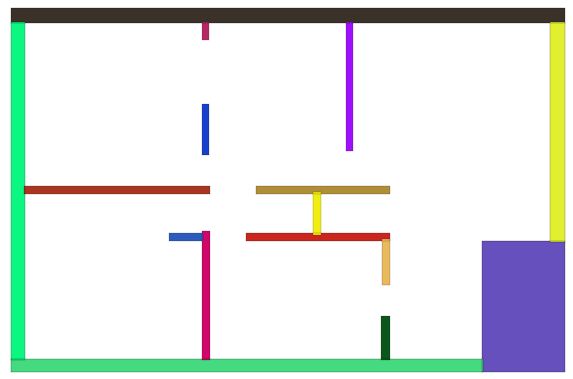

# pybullet-env-from-image
Build simple pybullet environment from binary image
The core code is from [adaptive-box](https://github.com/jnfran92/adaptive-boxes). I make some simplification of the code and add the interface to convert directly from binary image


# How to use
change the image path in `test.py` and filter threshold to generate satisfied number of rectangles
```python
python test.py
```

# Result
## input image


## output rectangle



# to do list
- decompose rectangles from binary image
- draw boxes in pybullet according to rectangle info
